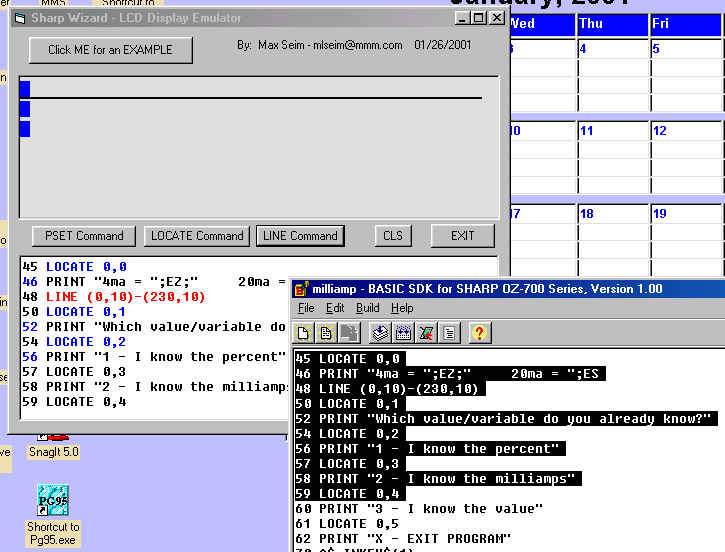



## Sharp Wizard LCD Emulator

### Description

I was programming a Sharp Wizard OZxx Organizer using SDK-Basic ... There is no way to see ahead of time where the PSET, LINE, LOCATE commands will place the text and graphics. So I whipped-up this little emulator. I can now enter commands manually and see where they are on the Wizard LCD display, or cut and paste from the SDK editor. There are some limitations, but it sure helps for laying out the crappy LCD display. For you Sharp Wizard fans, try this out and see if it makes it any easier to program.
 
### More Info
 

             |
---                |---
**Submitted On**   |2001-01-26 12:59:44
**By**             |[Max Seim](https://github.com/Planet-Source-Code/PSCIndex/blob/master/ByAuthor/max-seim.md)
**Level**          |Intermediate
**User Rating**    |5.0 (10 globes from 2 users)
**Compatibility**  |VB 5\.0
**Category**       |[Complete Applications](https://github.com/Planet-Source-Code/PSCIndex/blob/master/ByCategory/complete-applications__1-27.md)
**World**          |[Visual Basic](https://github.com/Planet-Source-Code/PSCIndex/blob/master/ByWorld/visual-basic.md)
**Archive File**   |[CODE\_UPLOAD141971262001\.zip](https://github.com/Planet-Source-Code/max-seim-sharp-wizard-lcd-emulator__1-14741/archive/master.zip)

